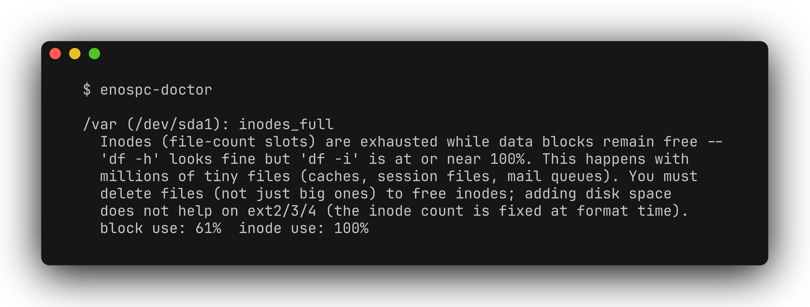

# enospc-doctor

[](https://github.com/zhuhroscar-tech/enospc-doctor/actions/workflows/ci.yml)
[](https://github.com/zhuhroscar-tech/enospc-doctor/releases)


Diagnose which distinct cause is behind a Linux `No space left on device`
(`ENOSPC`) error, instead of manually running `df -h`, `df -i`, `du -x`,
and `lsof +L1` and reconciling the numbers by hand.

## Simple explanation

Your Linux server just said the disk is full, but "full" can mean four
different things — actually out of space, out of file slots, a deleted
file a program is still holding open, or just a safety reserve kicking
in. This tool looks at the affected disk and tells you in plain
language exactly which one it is, instead of you running several
commands and reconciling the numbers by hand. It only reads system
information — it never deletes, frees, or changes anything.

## The problem

`ENOSPC` (errno 28) is one error message covering at least four genuinely
distinct root causes, extensively documented across multiple 2026 posts
walking the exact same multi-step manual ritual each time because no
single tool distinguishes them automatically:

1. **Genuine block exhaustion** — the filesystem is actually out of bytes.
2. **Inode exhaustion** — `df -h` looks fine, but the filesystem has run
   out of inode (file-count) slots, typically from millions of tiny files
   (session caches, mail queues, `node_modules`-style trees). On
   ext2/3/4 the inode count is fixed at format time — adding disk space
   does not help.
3. **Deleted-but-open files** — a process still holds a file descriptor
   open to a file that was already `rm`-ed (e.g. log rotation without a
   reload signal). `du` can't see it since the directory entry is gone,
   so `df` and `du` disagree — sometimes by tens of gigabytes.
4. **Reserved-block false-full** — ext4 reserves a percentage of blocks
   for root by default; ordinary (non-root) writes can fail with ENOSPC
   while a few percent of "used" space is actually just the reservation.

## What this does



```
$ enospc-doctor

/var (/dev/sda1): inodes_full
  Inodes (file-count slots) are exhausted while data blocks remain free --
  'df -h' looks fine but 'df -i' is at or near 100%. This happens with
  millions of tiny files (caches, session files, mail queues). You must
  delete files (not just big ones) to free inodes; adding disk space
  does not help on ext2/3/4 (the inode count is fixed at format time).
  block use: 61%  inode use: 100%
```

Run with `--all` to see every mounted filesystem including healthy ones,
or `--json` for machine-readable output. Exit code `2` means at least one
issue was found, `0` means everything is clean.

**Strictly read-only.** It never deletes, truncates, restarts a process,
or modifies any filesystem — it only reads `df`, `lsof`, and `tune2fs`
output.

## Install

Requires Python 3.9+ on Linux (uses `df`/`lsof`/`tune2fs`; runs but is
meaningless on macOS/Windows).

```bash
pip install enospc-doctor
```

Or run the standalone zipapp with no install:

```bash
curl -LO https://github.com/zhuhroscar-tech/enospc-doctor/releases/latest/download/enospc-doctor.pyz
python3 enospc-doctor.pyz --version
```

Verify the download against `SHA256SUMS.txt` in the same release before
running it.

## Usage

```bash
enospc-doctor                 # show only mounts with an issue
enospc-doctor --all           # show every mounted filesystem
enospc-doctor --json          # machine-readable output
enospc-doctor --threshold 90  # treat 90%+ usage as "near full" (default: 95)
```

## If it finds a problem

This tool only diagnoses; it never modifies anything. Once you know the
cause:

- `inodes_full` → find the directory with the most files (`find <mount>
  -xdev -type f | cut -d/ -f1-N | sort | uniq -c | sort -rn`) and clean
  it up; you cannot raise ext2/3/4's inode count after formatting.
- `deleted_open_files` → restart the listed process (safest), or
  truncate the file live via `truncate -s 0 /proc/<pid>/fd/<fd>` if a
  restart isn't acceptable.
- `blocks_full` → find the biggest consumers (`du -xh --max-depth=1
  <mount> | sort -rh`), then remove/relocate genuine data.
- `reserved_blocks_only` → either fix the underlying growth (this is a
  band-aid), or lower the reservation with `tune2fs -m <percent>
  <device>` if you understand the tradeoff (protects against root-only
  emergency writes; do not set it to 0 on the root filesystem casually).

## Uninstall

```bash
pip uninstall enospc-doctor
```
No config files, no persistent state — a stateless read-only diagnostic.

## Privacy / permissions

- No network access, no telemetry.
- Reads `df`, `lsof +L1`, and `tune2fs -l` output. Full `lsof` output
  covering other users' processes may require elevated privileges, same
  as any other use of `lsof`.
- Writes nothing to disk.

## Distro / architecture support

Works on any Linux distro with `df`/`lsof` (near-universal); `tune2fs`
(for the reserved-blocks check) is ext2/3/4-specific and its absence is
handled gracefully. Pure Python, no compiled dependencies.

## Reproducible build / test

```bash
git clone https://github.com/zhuhroscar-tech/enospc-doctor
cd enospc-doctor
python3 -m pip install -e .[dev]
python3 -m pytest -v
```

CI (`.github/workflows/ci.yml`) runs the suite on real Ubuntu runners
across Python 3.9 and 3.12, then builds and smoke-tests the wheel/sdist
and a standalone `.pyz` against real `df`/`lsof` output on the runner.

## License

MIT — see [LICENSE](LICENSE).
